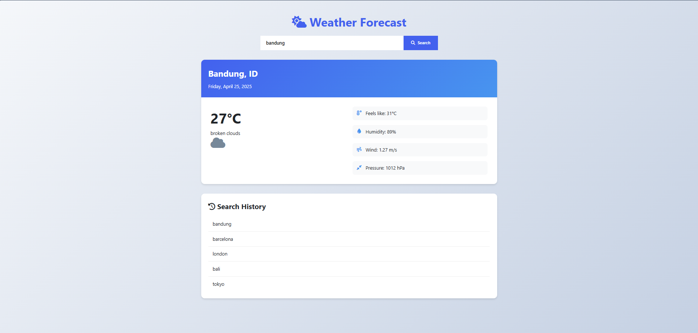

# WeatherPro 🌦️

A simple weather forecast application with real-time data and search history.


And you can try it here [weather-pro-Netlify](https://faruq-weatherapp.netlify.app/)

## Features ✨

- 🌍 Real-time weather data for any city
- 🔍 Search history
- 🌡️ Detailed weather information:
- 📅 Current date display

## Technologies Used 🛠️

- **Frontend**:
  - HTML5, CSS3, JavaScript (ES6+)
  - [Font Awesome](https://fontawesome.com/) for icons
  - CSS Grid/Flexbox for layout
- **API**:
  - [OpenWeatherMap API](https://openweathermap.org/api) (or your chosen weather API)

## Installation 💻

1. Clone the repository:
   ```bash
   git clone https://github.com/yourusername/weatherpro.git
   cd weatherpro
   ```
